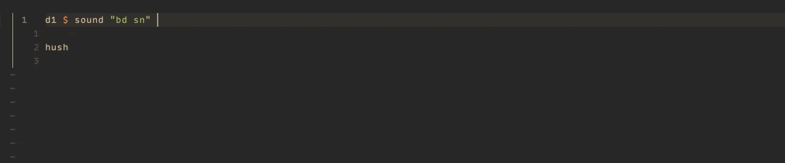

# cmp-tidal

Autocompletion for [Tidal Cycles](https://tidalcycles.org/) powered by [nvim-cmp](https://github.com/hrsh7th/nvim-cmp) and [hoogle](http://hackage.haskell.org/cgi-bin/hackage-scripts/package/hoogle).



## Requirements
- [neovim](https://github.com/neovim/neovim)
- [nvim-cmp](https://github.com/hrsh7th/nvim-cmp)
- [plenary.nvim](https://github.com/nvim-lua/plenary.nvim)
- [hoogle](http://hackage.haskell.org/cgi-bin/hackage-scripts/package/hoogle)

## Installation

### Nvim-cmp

Please have a look at the [offical repo](https://github.com/hrsh7th/nvim-cmp).

### Cmp-tidal

For [vim-plug](https://github.com/junegunn/vim-plug):

```vim
Plug 'nvim-lua/plenary.nvim'
Plug 'fools-mate/cmp-tidal'
```

For [packer.nvim](https://github.com/wbthomason/packer.nvim):

```lua
use {'fools-mate/cmp-tidal', requires = 'nvim-lua/plenary.nvim'}
```

### Hoogle

```sh
cabal install hoogle
hoogle generate
```

## Configuration

### Tidal
```lua
require("cmp").setup({
  sources = {
    {name = 'tidal'},
    -- ...more sources
  }
})
```

### Samples

```lua
require("cmp").setup({
  sources = {
    {name = 'tidal'},
    {name = 'tidal_samples'},
    -- ...more sources
  }
})
```

#### Options

By default `tidal_samples` will use the standard installation paths for the 'Dirt Samples'. 
You can change this by passing the absolute path to your 'Dirt Samples' folder to the `dirt_samples` option.

E.g.:
```lua
require("cmp").setup({
  sources = {
    {name = 'tidal'},
    {
      name = 'tidal_samples',
      option = {
        dirt_samples = '/Users/fools-mate/Library/Application Support/SuperCollider/downloaded-quarks/Dirt-Samples'
      }
    },
    -- ...more sources
  }
})
```

## Roadmap

- [ ] New option: `custom_samples` to pass additional custom sample folders
- [ ] Autocompletion for sample number (bd -> bd\*1)
- [ ] Caching

